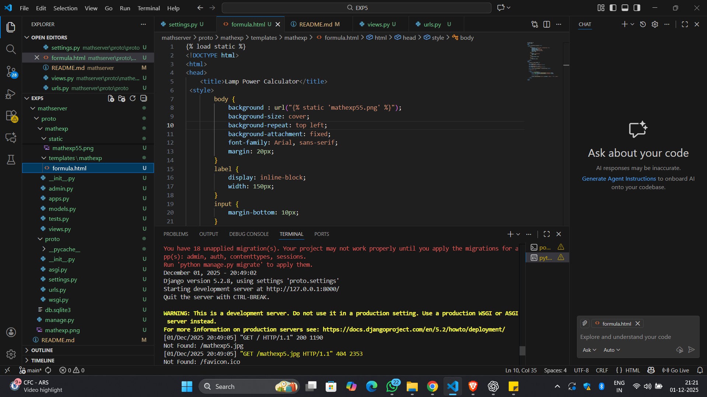
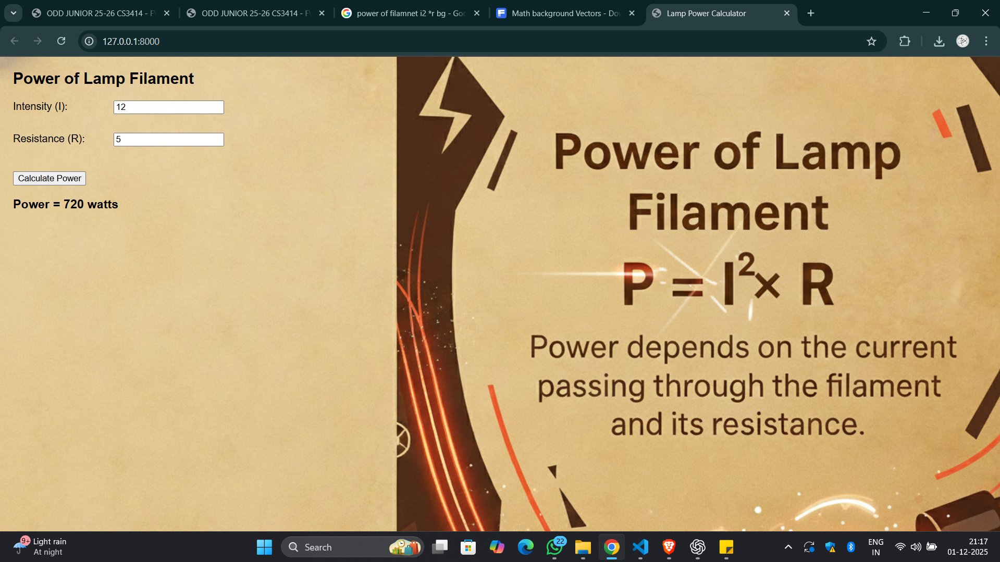

# Ex.04 Design a Website for Server Side Processing
# Date:28.11.2025
# AIM:
To design a website to calculate the power of a lamp filament in an incandescent bulb in the server side.

# FORMULA:
P = I2R
P --> Power (in watts)
 I --> Intensity
 R --> Resistance

# DESIGN STEPS:
## Step 1:
Clone the repository from GitHub.

## Step 2:
Create Django Admin project.

## Step 3:
Create a New App under the Django Admin project.

## Step 4:
Create python programs for views and urls to perform server side processing.

## Step 5:
Create a HTML file to implement form based input and output.

## Step 6:
Publish the website in the given URL.

# PROGRAM :
views.py
```
from django.shortcuts import render

def home(request):
    power = None

    if request.method == "POST":
        I = float(request.POST.get("intensity"))
        R = float(request.POST.get("resistance"))
        power = I * I * R  # Formula P = I²R

    return render(request, "mathexp/formula.html", {"power": power})
```
urls.py
```
from django.contrib import admin
from django.urls import path
from mathexp.views import home

urlpatterns = [
    path('admin/', admin.site.urls),
    path('', home),
]
```
html file
```

<!DOCTYPE html>
<html>
<head>
    <title>Lamp Power Calculator</title>
 <style>
        body {
            background : url("");
            background-size: cover;
            background-repeat: top left;
            background-attachment: fixed;
            font-family: Arial, sans-serif;
            margin: 20px;
        }
        label {
            display: inline-block;
            width: 150px;
        }
        input {
            margin-bottom: 10px;
        }
        button {
            margin-top: 10px;
        }
    </style>
</head>
<body>
    <h2>Power of Lamp Filament</h2>

    <label>Intensity (I): </label>
    <input type="number" id="intensity"><br><br>

    <label>Resistance (R): </label>
    <input type="number" id="resistance"><br><br>

    <button onclick="calculatePower()">Calculate Power</button>

    <h3 id="result"></h3>

    <script>
        function calculatePower() {
            let I = Number(document.getElementById("intensity").value);
            let R = Number(document.getElementById("resistance").value);

            let P = I * I * R; 

            document.getElementById("result").innerHTML = "Power = " + P + " watts";
        }
    </script>

</body>
</html>
```

# SERVER SIDE PROCESSING:

# HOMEPAGE:

# RESULT:
The program for performing server side processing is completed successfully.
